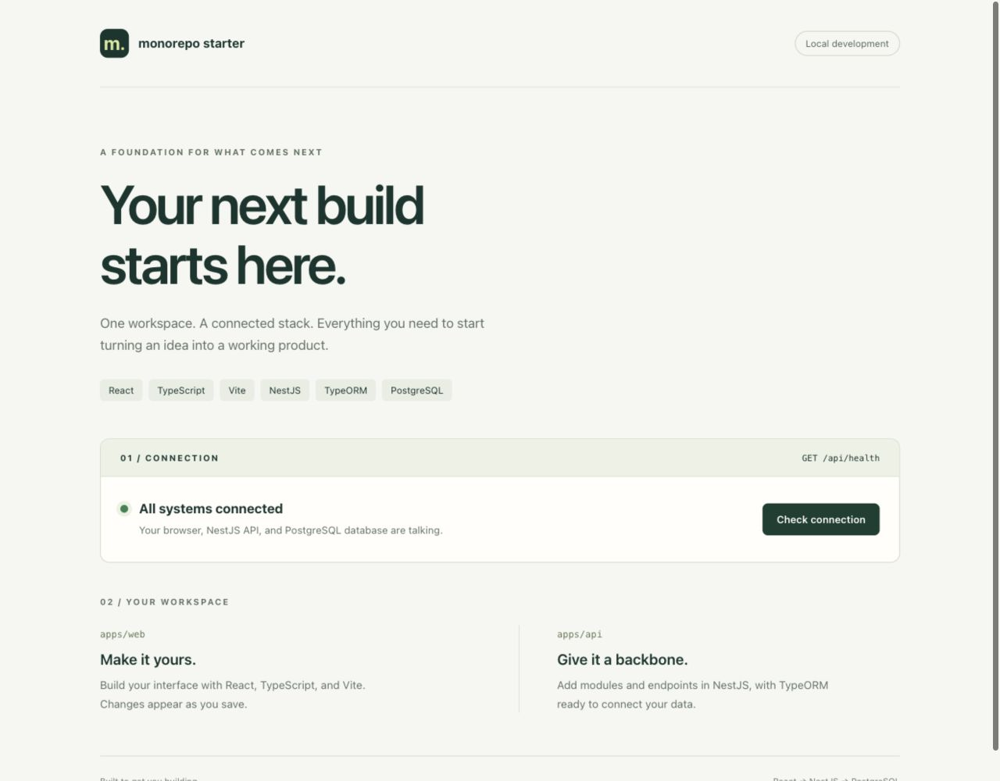

# Client–Server Monorepo

A React and NestJS starter for teams building TypeScript applications with PostgreSQL.

Connecting a frontend, API, and database should not consume the first hours of a project.
This repository provides one npm workspace, a working database health check, and
Docker Compose with hot reload so you can start implementing your product.



## Quick start: everything in Docker

Install Docker Desktop (or Docker Engine with Compose v2), then run from the repository root:

```sh
cp .env.example .env
docker compose up --build --wait
```

Open [localhost:5173](http://localhost:5173) and select **Check connection**.
The page reports success only after the API queries PostgreSQL.
The API endpoint is [localhost:3000/api/health](http://localhost:3000/api/health).

```sh
docker compose logs -f api web  # Follow development logs
docker compose down           # Stop services; retain database data
```

Source changes under `apps/api/src` and `apps/web/src` reload automatically.
Rebuild with `docker compose up --build --wait` after changing dependencies or
configuration. Containers use their own Linux dependencies; host `node_modules`
are never mounted into them. The Compose setup is for local development.

## Local Node development

Use Node **24 LTS** (24.11+), npm **10.x**, and a running Docker daemon.
`.nvmrc` selects Node 24 when using nvm. Node 24 bundles npm 11, so install
npm 10 after switching versions.

The npm major version is restricted to 10 for DigitalOcean App Platform's Node.js
buildpack, whose dependency installation uses `--unsafe-perm`. Newer npm versions
can reject that flag before the application build begins.

```sh
nvm install
nvm use
npm install --global npm@10
cp .env.example .env
npm ci
npm run db:up
npm run dev
```

If you already created `.env`, retain your existing file. If switching from the
full Docker stack, first run `docker compose down` to free the API and web ports.
`npm run dev` starts both servers; Ctrl+C stops both.

## Architecture

```text
Browser → Vite :5173 → /api proxy → NestJS :3000 → TypeORM → PostgreSQL :5432
```

- **Frontend:** React 19, TypeScript, Vite 8; pending, success, and error states for
  a manual connection check. Requests time out after five seconds.
- **Backend:** NestJS 12, TypeORM 0.3, and the PostgreSQL driver. `GET /api/health`
  executes `SELECT 1`, returns `{"status":"ok","database":"up"}`, and sends
  `Cache-Control: no-store`. Database failures return HTTP 503 with
  `{"status":"error","database":"down"}`.
- **Database:** PostgreSQL 17 with a persistent Compose volume. Schema changes
  use explicit migrations; `synchronize` and automatic migration execution are off.
- **Tooling:** npm workspaces, strict TypeScript, Vitest, React Testing Library,
  V8 coverage, and Prettier. The committed lockfile pins the resolved dependencies.

```text
apps/
  api/src/
    config/       # Validated environment variables and .env loading
    database/     # TypeORM options and migration CLI data source
    health/       # Controller and database health service
  api/tests/      # Mirrors the API source structure
  web/src/
    api/          # HTTP boundary
    App.tsx       # Starter page
    styles.css
  web/tests/      # HTTP and rendered UI behavior tests
compose.yaml
Dockerfile.dev
```

## Commands

Run these from the repository root:

| Command                                   | Purpose                                           |
| ----------------------------------------- | ------------------------------------------------- |
| `npm run dev`                             | Run both apps with hot reload                     |
| `npm run dev:web` / `npm run dev:api`     | Run one app                                       |
| `npm run db:up` / `npm run db:down`       | Start / stop only PostgreSQL                      |
| `npm run build`                           | Build both apps to their `dist` directories       |
| `npm run start -w @app/api`               | Run the compiled API (requires a database)        |
| `npm run preview -w @app/web`             | Preview the web build on port 4173 with API proxy |
| `npm test`                                | Run all unit tests with enforced coverage         |
| `npm run test:watch`                      | Interactive unit tests                            |
| `npm run typecheck`                       | Check apps, tests, and TS configuration           |
| `npm run format` / `npm run format:check` | Format / check formatting                         |
| `npm run check`                           | Types, coverage tests, builds, and formatting     |

`npm run smoke` verifies the running frontend, API proxy, and database.

## Environment

Copy `.env.example` to `.env`; all supported settings are documented there.
Keep credentials in `.env`, which Git ignores. The sample password is only for
local development. No credentials are embedded in frontend bundles.

Compose publishes services on `127.0.0.1`. `POSTGRES_PORT`, `API_PORT`, and
`WEB_PORT` control the exposed host ports. Inside Docker, the API uses `db:5432`
and Vite proxies to `api:3000`. For local Node development, when changing
`API_PORT`, also update `API_PROXY_TARGET` to the matching URL.

Vite proxies `/api` in development and preview, so no permissive CORS policy is
needed. When deploying, configure your reverse proxy to send `/api` to NestJS and
serve `apps/web/dist` as static files; Vite's development proxy is not part of the build.

## Database migrations

The scaffold intentionally defines no product tables. Add entities as
`apps/api/src/<feature>/<name>.entity.ts`; TypeORM discovers them automatically.
Register repositories in feature modules with `TypeOrmModule.forFeature([Entity])`.

With PostgreSQL running, generate and inspect a migration after adding an entity:

```sh
npm run migration:generate -- src/database/migrations/CreateInitialSchema
npm run migration:run
```

The generation path is relative to **apps/api**. Commit the generated migration
with its entity changes. Roll back the most recent migration with
`npm run migration:revert`. Running `npm run migration:run` on the unmodified
starter succeeds with no pending migrations.

For the full Docker workflow, run migrations in the API container:

```sh
docker compose exec api npm run migration:run
```

The CLI and NestJS share the same connection options and `.env` loader. Do not
enable `synchronize` against a database with data you need to retain.

## Tests and verification

`npm test` enforces **100% lines, branches, functions, and statements per file**
for application code. Tests cover configuration boundaries, database outages,
invalid API responses, pending UI state, and retrying after failure. Database
and fetch boundaries are faked; unit tests do not require Docker or network access.
Bootstrap-only exclusions are listed with explanations in `vitest.config.mts`.
The HTML coverage report is generated at `coverage/index.html`.

For a live check after startup:

```sh
curl --fail http://localhost:3000/api/health
curl --fail http://localhost:5173/api/health
```

Both should return `{"status":"ok","database":"up"}`. The second request checks
the Vite proxy as well as NestJS and PostgreSQL.

`npm run smoke` checks both endpoints, their JSON and cache headers, and the
frontend HTML. For custom ports, pass web and API URLs in that order:

```sh
npm run smoke -- http://localhost:5174 http://localhost:3001
```

GitHub Actions runs four independent jobs on pull requests and pushes to `trunk`:

- `static-checks`: formatting and TypeScript checks.
- `unit-tests`: unit tests with the enforced coverage thresholds above.
- `build`: production builds for the web client and API.
- `integration`: Compose startup, live smoke checks, and the migration command;
  service logs are shown on failure and services are always stopped afterward.

Each job runs independently, so a failure in one category does not prevent the
others from running. Use `npm run check` locally to run TypeScript, coverage tests,
builds, and formatting together; live integration checks require the running stack.

## Troubleshooting

- **Cannot connect to Docker:** start Docker Desktop before using Compose.
- **Port already in use:** stop the conflicting service or change the host ports
  in `.env`. Vite uses strict port selection rather than silently changing ports.
- **Database credentials changed:** PostgreSQL applies initialization credentials
  only when creating its data directory. Keep the existing credentials or migrate
  the database user. For disposable local data only, `docker compose down -v`
  removes the database volume and its contents before a fresh start.
- **Connection unavailable:** inspect `docker compose ps` and
  `docker compose logs api db`. Start PostgreSQL before running the local API.

## Roadmap

Add product-specific entities, validation, authentication, and deployment
configuration when the application's requirements are known. They are not part
of this scaffold.
